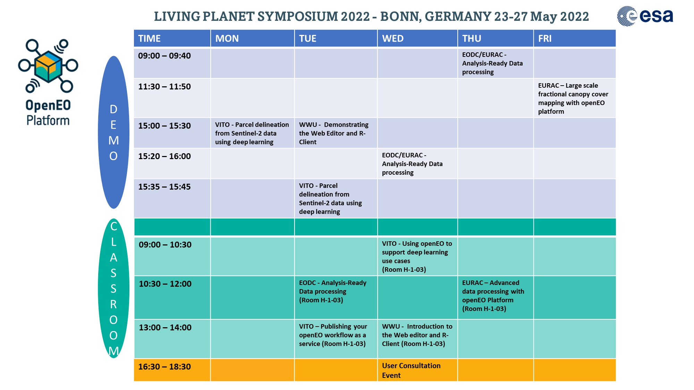

# LPS_presentations
Repository to share and work on Notebooks and Presentations for each classroom training and demo

Please follow the folder structure given and add your presentations + jupyter notebooks.

# Schedule 
Latest PDF schedule also available here: \openEO platform all - Outreach ( WP 6000 )\events\LPS 2022 and User Consultation Event\LPS event planning

Note: The two VITO slots: Classroom - Publishing your openEO workflow as a service (durtation: 30 mins) and Demo Parcel delineation (duration: 10 mins) are actually shorter than the schedule shows. This is due to the other slots on the other days being longer. The starting time is the same

